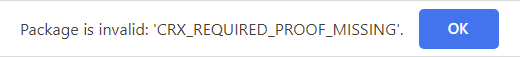
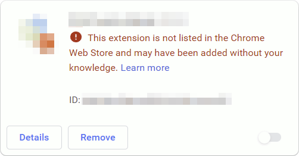

When I made my first extension back in ye olden days - in the times of 30°C summers and $1.5 Costco hot dog meals - Google allowed developers to self-host Chrome extensions. This allowed users to install extensions directly from their website, without having to go through the Chrome Web Store.

But as with all good things, a few bad apples spoil it for the rest of us. By allowing users to install extensions from anywhere, Google didn't have any control over what extensions were allowed. This made extensions a prime target for malware and search hijacking, with no way to revoke bad extensions once they were out there. In its continuous quest to protect users (... and maybe gain a bit of control over their ecosystem. It _is_ Google, after all), Google [blocked installation of extensions](https://developer.chrome.com/docs/extensions/mv2/hosting_changes/) from outside the Web Store on all other platforms than Linux.

The block is pretty extensive. If you try to install an extension by simply following a link, as you used to be able to, you'll be met with a `CRX_REQUIRED_PROOF_MISSING` error with no way to bypass it:

<div align="center">
  


</div>

If you manually download the .crx and drag it onto the `chrome://extensions` page you'll get a bit further - you'll even be able to install it! Immediately upon installing it, however, you'll be met with an error and the extension will be [hard-disabled](https://support.google.com/chrome_webstore/answer/2811969?visit_id=637914365688248290-669006669&rd=1):

<div align="center">



</div>

This is a bit problematic for a small number of use cases. I recently ran into a situation where I wanted to install an extension on computers in an organization, without access to the great big Internet. With no way to reach the Chrome Web Store, downloading the extension from there was a no-go.

Luckily Google has left one possibility open. In addition to [loading the extension unpacked](https://developer.chrome.com/docs/extensions/mv3/getstarted/#unpacked) (which requires a lot of technical work from the user, and doesn't support auto-updating) there is one more way to install self-hosted extensions in Chrome that still works: enterprise policies.

For the purpose of self-hosting extensions, the following policies are relevant:

<dl>
<dt>

[ExtensionInstallSources](https://chromeenterprise.google/policies/#ExtensionInstallSources)

</dt>
<dd>

Lists the domains from which extension installations are allowed. Note that both the _host_ domain (where the .crx is fetched from) and the _referrer_ domain (where the link to the .crx is clicked from) must be added.  
The value is a list of strings, with each entry specifying an allowed domain using [a match pattern](https://developer.chrome.com/docs/extensions/mv3/match_patterns/)

</dd>
<dt>

[ExtensionInstallAllowlist](https://chromeenterprise.google/policies/#ExtensionInstallAllowlist)

</dt>
<dd>

Lists the specific extensions that can be installed. The value is a list of strings, with each entry being the ID of an allowed extension.

</dd>
</dl>

In order for an extension to be installable, it must be permitted by both of those policies. In addition to this, the usual [hosting requirements](https://developer.chrome.com/docs/extensions/mv3/linux_hosting/#hosting) must be met (namely serving the .crx with `Content-Type: application/x-chrome-extension`).

This means that an extension hosted at `https://jfagerberg.me/extension.crx`, being linked to by `https://example.com`, with the extension ID `aaaaaaaabbbbbbbbccccccccdddddddd`, can be installed by any user that has the following registry file installed, or has the corresponding group policies:

```reg
[HKEY_LOCAL_MACHINE\SOFTWARE\Policies\Google\Chrome]

[HKEY_LOCAL_MACHINE\SOFTWARE\Policies\Google\Chrome\ExtensionInstallSources]
"1"="https://example.com/*"
"2"="https://jfagerberg.me/*"

[HKEY_LOCAL_MACHINE\SOFTWARE\Policies\Google\Chrome\ExtensionInstallAllowlist]
"1"="aaaaaaaabbbbbbbbccccccccdddddddd"
```

This is, as far as I am aware, the only way to self-host extensions in modern Chrome.
