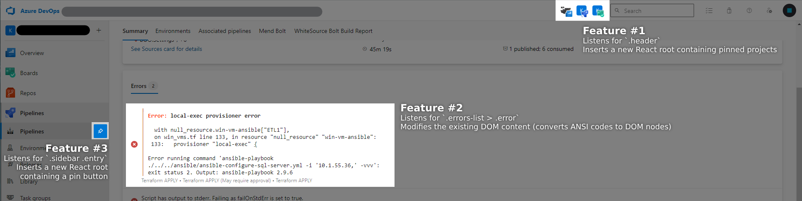

The world of frontend web development has in recent years transitioned largely to SPA development; frameworks like React, Angular and Vue, and the massive ecosystem of tools that surround them, make it attractive to write applications that update the DOM themselves instead of relying on the browser's built-in navigation.

This creates a challenge for web extensions that wish to modify the DOM in one way or another: how do you trigger your own DOM modifications, so the UI stays consistent, and your changes aren't removed when the underlying framework reconciles the DOM structure with its own internal structure?

An initial approach might be to hook into the underlying framework: if we can modify the frameworks internal structure instead of modifying the DOM, then our changes will survive framework changes; we would essentially be re-using the same source-of-truth as the framework. Unfortunately, most frameworks do not offer such hooks - and with the privacy provided by JS scoping, most also encapsulate their code in a way that is unreachable for us.

A different approach would be to observe the DOM, and re-apply our changes whenever an element we're interested in is updated. This requires some finessing to catch all changes, and risks introducing jank if we aren't careful, but generally works quite well. In this blog post I'll describe the framework I tend to use when writing page-modifying web extensions in an SPA-dominated world.

## The idea

When writing web extensions, we often want to modify specific parts of the DOM, so we can extend or replace functionality on the page. Traditionally this would be done by modifying the page whenever our script is injected - usually on page load - but this faces challenges when it comes to SPAs. Since they don't trigger page reloads, we must instead listen for DOM changes directly.

Through my work on web extensions I've found it useful to split the functionality up into reusable parts. My go-to architecture looks a little something like this:


## The injection instances

Each "injection" is a simple function that gets triggered whenever an element gets inserted or removed from the DOM, along with related information about which elements it is interested in. In particular, it is defined by the TypeScript type

```typescript
type InjectionConfig = {
  selector: string; // a selector matching any element we are interested in
  mount: ($elm: InjectedHTMLElement) => void; // called when a relevant element is added to the DOM
  unmount?: ($elm: InjectedHTMLElement) => void; // called when a previously mounted element is removed from the DOM
};

// extend our notion of HTMLElements to keep track of which injections it is related to; this will be useful later
type InjectedHTMLElement = HTMLElement & {
  ___attached?: Set<InjectionConfig>;
};
```

This is a very flexible structure; by enforcing no opinions on what the injection does with the element it is interested in, we allow it to do a number of things. Do manual DOM modifications? Sure thing. Simple logging? I don't see why not. Inject your own React root, in case you want to develop your extensions UI in React? Easily implemented using a helper function:

```typescript
type InjectedReactElement = InjectedHTMLElement & {
  ___reactRoot?: ReturnType<typeof createRoot>;
};

/** Utility function to ease the writing of React-based injections */
function reactInjection(
  selector: string, // selectors for elements we're interested in
  rootGenerator: ($elm: HTMLElement) => HTMLElement, // generates the root element we want to insert our React node into
  reactNode: ($elm: HTMLElement) => React.ReactNode // generates the React node we want to render (e.g. <App />)
): InjectionConfig {
  return {
    selector,
    mount: ($elm: InjectedReactElement) => {
      const $container = rootGenerator($elm);
      const root = createRoot($container);
      Object.defineProperty($elm, "___reactRoot", {
        enumerable: false,
        value: root,
      });
      root.render(reactNode($elm));
    },
    unmount: ($elm: InjectedReactElement) => {
      if (!$elm.___reactRoot) {
        return;
      }
      $elm.___reactRoot.unmount();
    },
  };
}
```

## The observer

The job of actually observing the DOM is also relatively simple: since each injection defines the selectors it is interested in, the only job of the observer is to keep track of elements as they are added and removed:

```typescript
class InjectionObserver {
  #observer: MutationObserver;
  #injections: InjectionConfig[];
  #observed: Set<InjectedHTMLElement> = new Set();

  constructor(injections: InjectionConfig[]) {
    this.onMutations = this.onMutations.bind(this);
    this.attach = this.attach.bind(this);
    this.detach = this.detach.bind(this);

    this.#injections = injections;
    this.#observer = new MutationObserver(this.onMutations);
    this.#observer.observe(document.documentElement || document.body, {
      subtree: true,
      childList: true,
    });
    this.attach(document.documentElement || document.body);
  }
  disconnect() {
    this.#observer.disconnect();
  }

  attach($elm: HTMLElement) {
    this.#injections.forEach((config) => {
      const { selector, mount } = config;
      const $elms: InjectedHTMLElement[] = Array.from(
        $elm.querySelectorAll ? $elm.querySelectorAll(selector) : []
      );
      if ($elm.matches && $elm.matches(selector)) {
        $elms.push($elm);
      }
      $elms.forEach(($elm) => {
        if (!$elm.___attached) {
          Object.defineProperty($elm, "___attached", {
            value: new Set([config]),
            enumerable: false,
            configurable: true,
          });
          mount($elm);
          this.#observed.add($elm);
        } else if (!$elm.___attached.has(config)) {
          $elm.___attached.add(config);
          mount($elm);
        }
      });
    });
  }

  detach($elm: HTMLElement) {
    this.#observed.forEach(($mounted) => {
      if (!$mounted.___attached) {
        return;
      }
      if ($elm.contains($mounted)) {
        $mounted.___attached.forEach((config) => config.unmount?.($mounted));
        this.#observed.delete($mounted);
        delete $mounted.___attached;
      }
    });
  }

  onMutations(records: MutationRecord[]) {
    records.forEach((record) => {
      record.removedNodes.forEach(this.detach);
      record.addedNodes.forEach(this.attach);
    });
  }
}
```

## The result

This architecture is an incredibly flexible way implement web extensions for SPA websites. By giving each individual feature the ability to easily react to relevant elements being added or removed, we save ourselves a lot of internal dependencies.

For an example of how this can be used, see [my web extension for Azure DevOps](https://github.com/birjj/azdo-enhancer), which primarily uses React for its custom UI, and plain JS for non-UI DOM modifications:



Here we have a number of features, each implementing a different part of the extension:

<dl><dt>Feature #1 - Pinned projects</dt>
<dd>

Uses the `reactInjection` helper function to insert a new React node in the header, whenever the header is added or removed. This React node renders a list of pinned projects. Since projects are pinned from other parts of the extension, they are kept track of in a [zustand](https://github.com/pmndrs/zustand)-based state store. This allows the extension to update the React nodes across React roots, or even from non-React parts of the extension.

</dd>
<dt>Feature #2 - Correctly rendered errors</dt>
<dd>

Uses a plain injection, with no React involved. Whenever a new error is rendered on the error list it parses the error content, and - if the error contains ANSI code - replaces it with a parsed HTML version of the ANSI error. This is done in plain JS.

</dd>
<dt>Feature #3 - Project pinning</dt>
<dd>

Uses the `reactInjection` helper function to insert a new React node in each sidebar link. The props for this React node is generated on a case-by-case basis, by parsing the sidebar link. It contains a button that, when clicked, toggles the pinned status of a project in the zustand store from feature #1.

</dd>
</dl>
