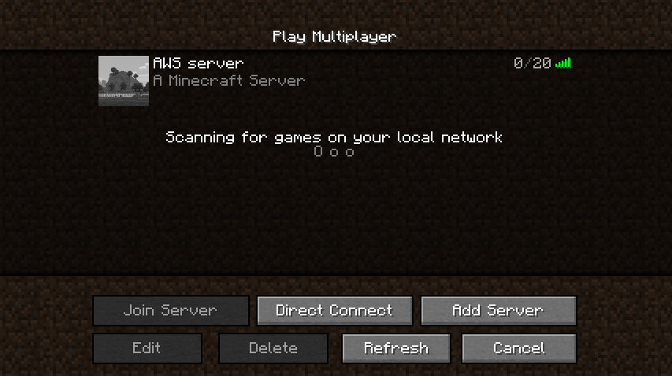

Normally AWS wouldn't be the best option for running a Minecraft server, for the simple reason that Minecraft cannot normally use the scaling features that AWS is known for. Compared to other VPS providers Amazon simply cannot compete when it comes to price.

There is one crucial advantage however: shutting down a server means you no longer have to pay for it until you boot it back up.

If the reason you want a server is to play with your friends, you might end up only using the server for a couple of hours a day. Shutting down the server when nobody's on it makes for some _significant_ savings. Let's do some quick maths for an EC2 instance with $4$ GB of RAM (t2.medium):

$$
\begin{aligned}
    \text{\$}0.0528 \text{ per hour} \cdot 2 \text{ hours per day} \cdot 30 \text{ days per month} \\
    = \text{\$} 3.17 \text{ per month}
\end{aligned}
$$

If you run your server for an average of 2 hours a day, you'll end up spending just around $\text{\$}3$ a month. That's pretty good for a server with $4$ GB of RAM.  
There's just one problem: how do we keep the server alive whenever someone wants to play on it, without having to manually start and stop it?

The solution is, of course, the same as the solution to every other problem in life: throw more servers at it! Except, y'know, cheaper servers this time. If we run a t3.nano at spot pricing, it'll cost us $\text{\$} 1.30$ extra per month. We can then use that to keep track of when we should start or stop the bigger t2.medium server, landing us at just about $\text{\$} 4.5$ a month.

At that price, it's still pretty respectable. That being said, there are some definite downsides: the price quickly shoots up if you use it for more than 2 hours a day on average, since we're running the t3.nano on spot pricing it might not always be available, and it takes a minute or two to launch the t2.medium when we need it.  
Truthfully I wouldn't really recommend doing this unless you use your Minecraft server very rarely - but I've already developed the proxy server we need for this to work, so ¯\\\_(ツ)\_/¯

With all that introduction out of the way, let's get to the fun part.

## Time for the nitty-gritty

I won't be covering how to get a Minecraft server setup on an EC2 instance; if you're interested in that there are other [far more thorough](https://www.youtube.com/watch?v=p-MnLSWuddE) guides out there.

I'm far more interested in the novel part: how do we write an application that monitors a Minecraft server, and determines when there is or isn't a demand for it?

Determining when we should shut down the server is easy enough. All Minecraft servers respond to so-called [Server List Pings](https://wiki.vg/Server_List_Ping), which are
requests sent by the game when people view the server on the server list. The response includes stuff like the description, version, and icon of the same - and crucially also the number of players currently on it.

We can simply send out pings of our own every now and then, and keep track of how many players are on the server. If it's been inactive for, let's say 5 minutes, we can decide that it's time to kill it off.

The far more interesting part is deciding when to start it back up.

We can decide on a few different approaches here: maybe we want a website with a button you can click when you want to play? No, that'd make way too much sense.  
Surely the better way is to write ourselves a fake Minecraft server to respond to Server List Pings, boot up the real Minecraft server if it's offline when it receives one, and then proxy the player connection to the real Minecraft server once it's up and running.  
If there's one thing I'm good at, it's creating needlessly complex solutions for the sake of making things ever so slightly more convenient.

## Minecraft servers but without the Minecraft

Writing our own Minecraft server sounds pretty daunting. Luckily for us, we don't have to, thanks to the friendly guys over on [PrismarineJS](https://github.com/PrismarineJS). By scraping the Minecraft wiki for protocol information, they've created themselves a framework for interacting with clients and servers alike - and exposed it all as a [neat library](https://github.com/PrismarineJS/node-minecraft-protocol) for us to use. Big thanks to them!

This means that we have a nice interface for us to use to respond to incoming connections, and since we don't need to actually simulate Minecraft itself as we never want players to join, we have a somewhat easy task ahead of us. The flowchart for our proxy server looks a little something like this:

Responding to Server List Pings is directly exposed by the minecraft-protocol library, so [our implementation](https://github.com/birjolaxew/aws-minecraft-proxy/blob/50d8ceae5a409db0e9db17dc94862e425576edb0/src/server.js#L99-L121) there is simple. The same goes for [kicking players](https://github.com/birjolaxew/aws-minecraft-proxy/blob/50d8ceae5a409db0e9db17dc94862e425576edb0/src/server.js#L47-L49).  
Proxying the TCP connection is a bit more low-level, but [far from complex](https://github.com/birjolaxew/aws-minecraft-proxy/blob/50d8ceae5a409db0e9db17dc94862e425576edb0/src/server.js#L60-L79), and since Amazon are nice enough to provide us with a CLI for communicating with AWS, all we have to do is run `aws ec2 start-instances --instance-ids i-0123456789abcdef` to start our Minecraft server.

And that's pretty much all we need to do for our proxy server to work! There are of course a couple of implementation details like protocol mismatches to keep in mind, but those are barely worth mentioning. I guess the entire point of this blog post mostly has been to tell you that I've implemented all this stuff in [a neat little program](https://github.com/birjolaxew/aws-minecraft-proxy), to make it a breeze to set up if you should ever want to.

Now if you'll excuse me, I have some Minecraft to play.
