<centered-title>
    <h1>Rondane National Park</h1>
    <small>September, 2018 ⋅ Norway</small>
</centered-title>

Rondane in central Norway is the oldest national park in the country. It's a beautiful place, with slightly easier trecking than in the neighboring Jotunheimen national park. I visited during fall, backpacking around the park for a week along with a group of newer hikers.

<picture-grid columns="2">
    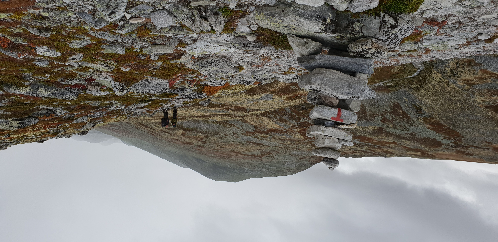
    
    
</picture-grid>

As is common in Norway, the trekking facilities in the park are exceedingly well maintained. The trails themselves are marked by DNT's iconic 'T's, and both manned and unmanned huts are available in the more well-traveled parts.

<picture-grid columns="2">
    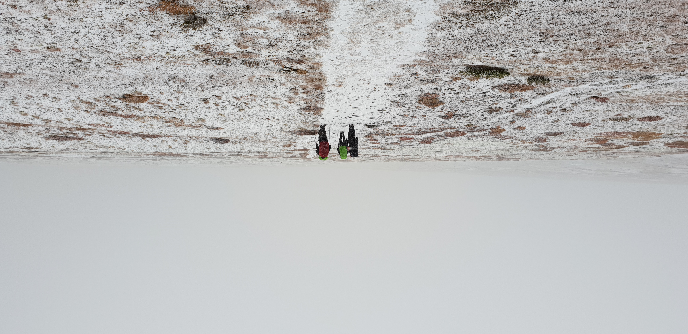
    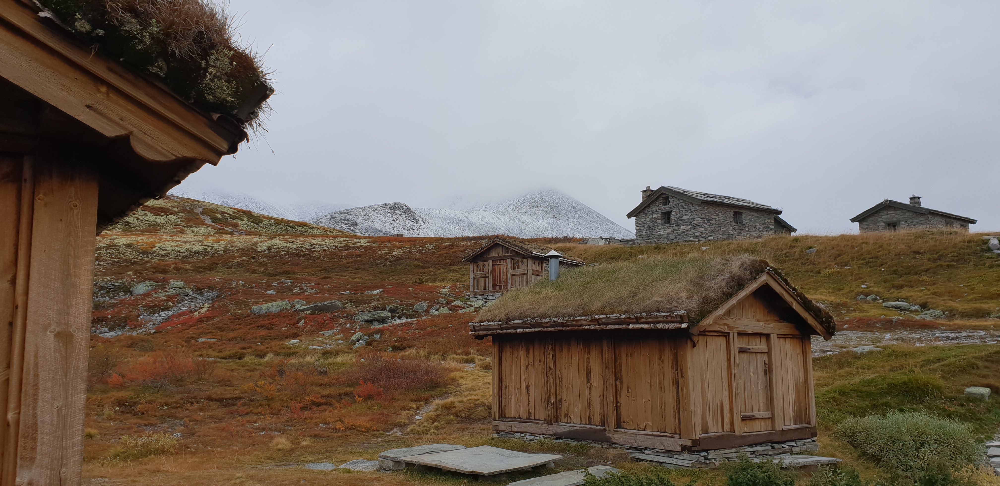
    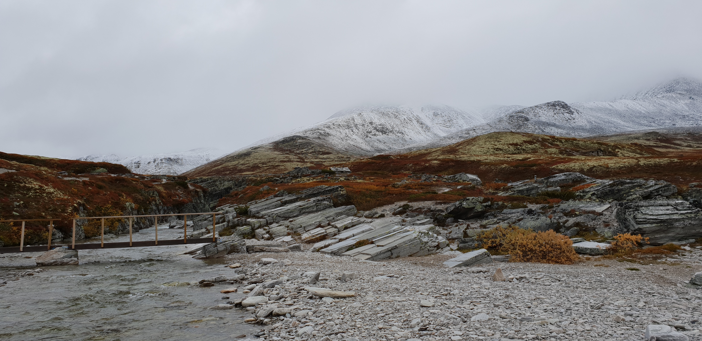
</picture-grid>

With the fall colors in full swing, the views were absolutely stunning. I would definitely recommend this trip for anyone interested in hiking, or simply exploring the Norwegian mountains without having to climb any. There are plenty of huts throughout the park, so you can choose between backpacking or day hiking - or just use them to seek refuge from the rain as we did in the wonderfully charming huts near [Peer Gynt-hytta](https://www.visitnorway.dk/listings/peer-gynt-hytta-i-rondane-nasjonalpark/199463/).

<centered-title>
    <h1>Jotunheimen National Park</h1>
    <small>August, 2018 ⋅ Norway</small>
</centered-title>

Jotunheimen is probably best known for the striking contrast of the lakes of Gjende and Bessvatnet; separated by the 400m vertical drop of the mountain ridge Besseggen, the two lakes are strikingly differently colored owing to the glacial water in Gjende and lack of same in Bessvatnet.

The path along Besseggen is one of the most popular walks in Norway and attracts a significant amount of tourists. The rest of Jotunheimen is somewhat less traveled, with the exception of Galdhøpiggen - Norway's tallest mountain.

<picture-grid columns="2">
    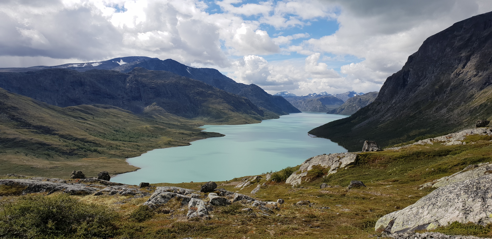
    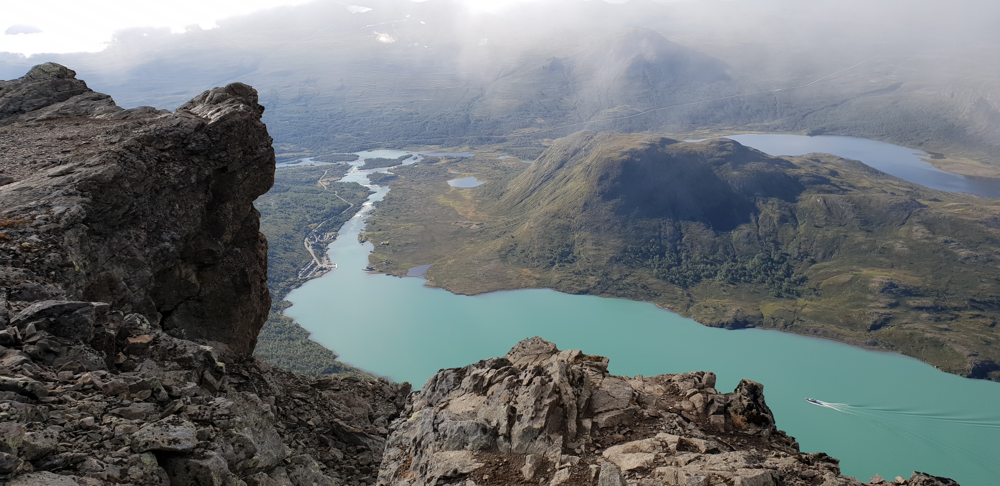
    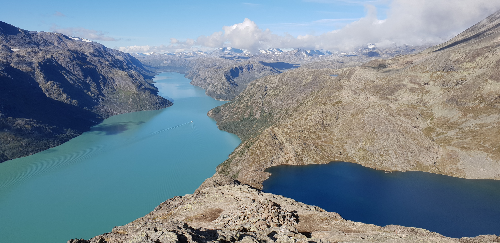
    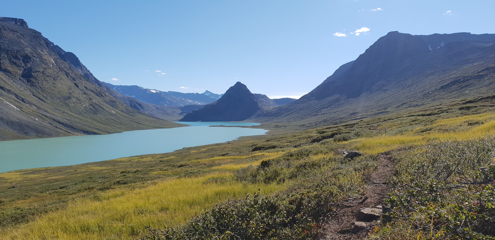
</picture-grid>

I went to Jotunheimen for a solo backpacking trip, starting with Besseggen and then proceeding off the normal trail onto the less traveled outskirts.

The plan was to make my way to the nearby Glittertind, Norway's second tallest mountain at just 3 meters less than Galdhøpiggen. Nestled between two popular mountain lodges, the fairly easy trail to the summit is also one of the more trafficked mountain trails in Norway.

At the very summit is a glacier, which has led to some debate about which of the mountains is taller. It used to be that, counting the glacier, Glittertind was quite a bit taller than Galdhøpiggen - but "luckily" the glacier has shrunk enough to undisputably give Galdhøpiggen the title.

<picture-grid columns="2">
    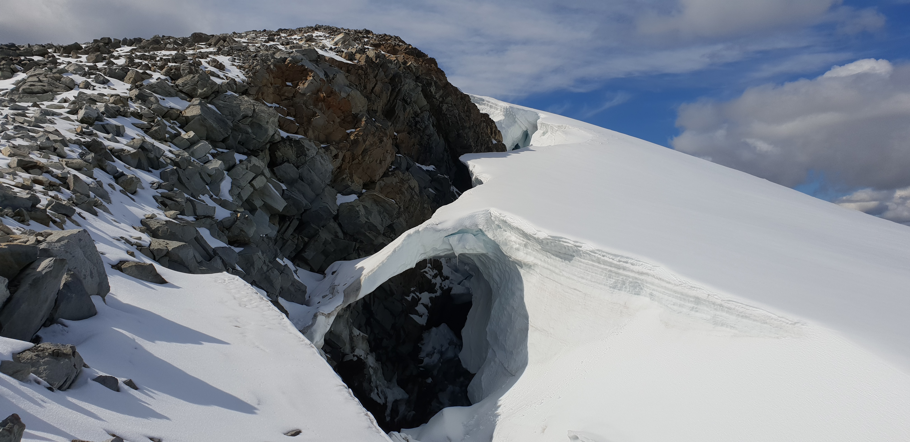
    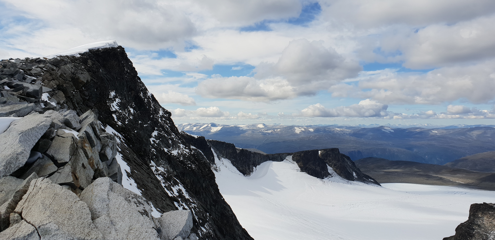
    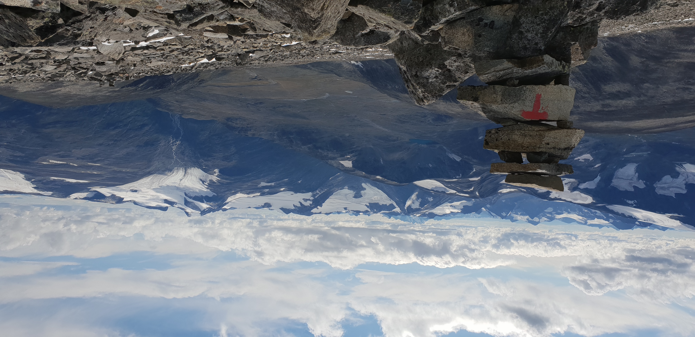
</picture-grid>

The remainder of the trip was fairly run of the mill, passing through valleys and mountain passes as I circled my way back. Despite this latter half of the trip being plagued by rain and some unnecessarily strenuous days owing to mistakes on my part, this trip was a great experience. For anyone who, like me, has a bit of a mountain fetish, Jotunheimen is a must-visit for any hiking trip in Norway.

<picture-grid columns="2">
    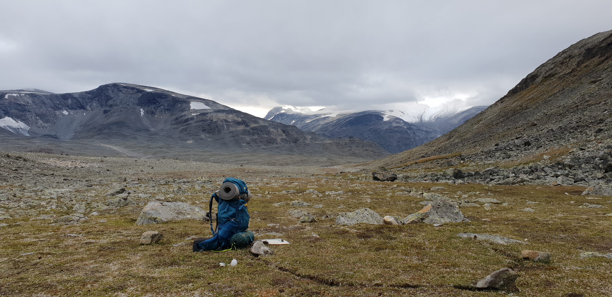
    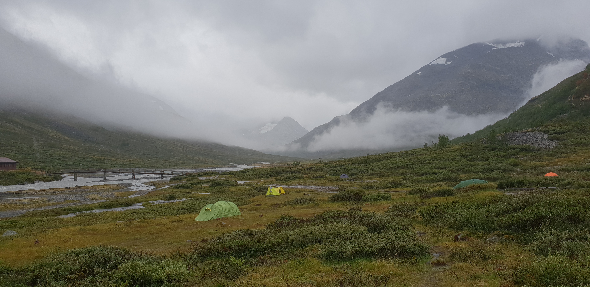
    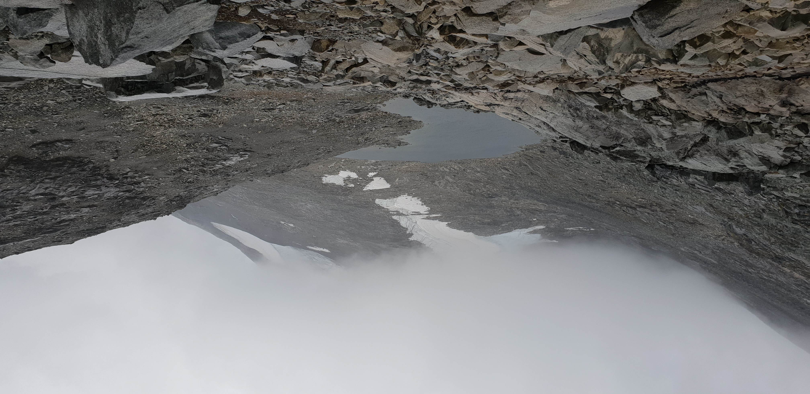
    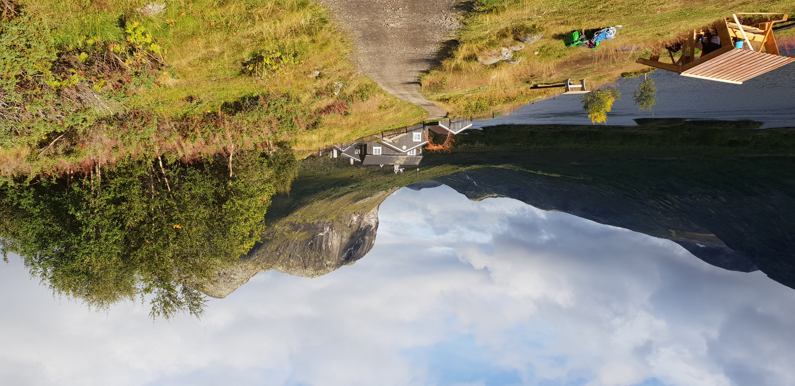
</picture-grid>
