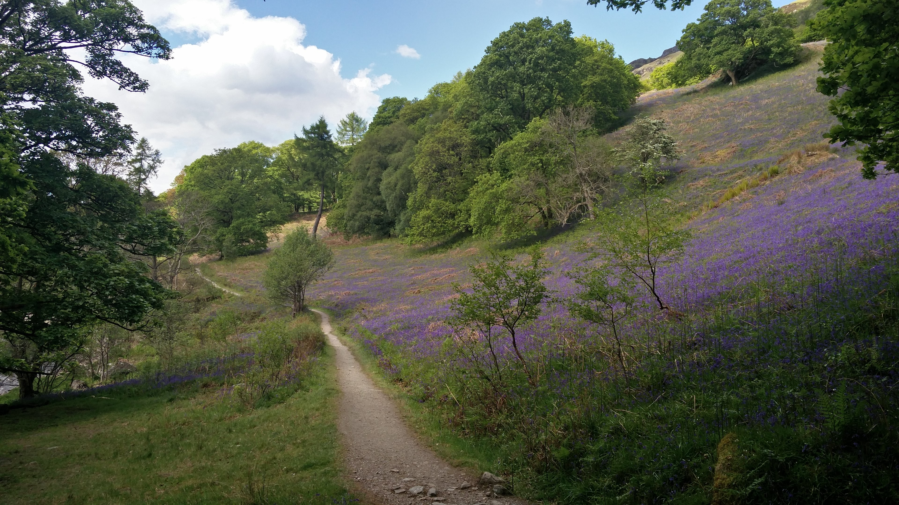
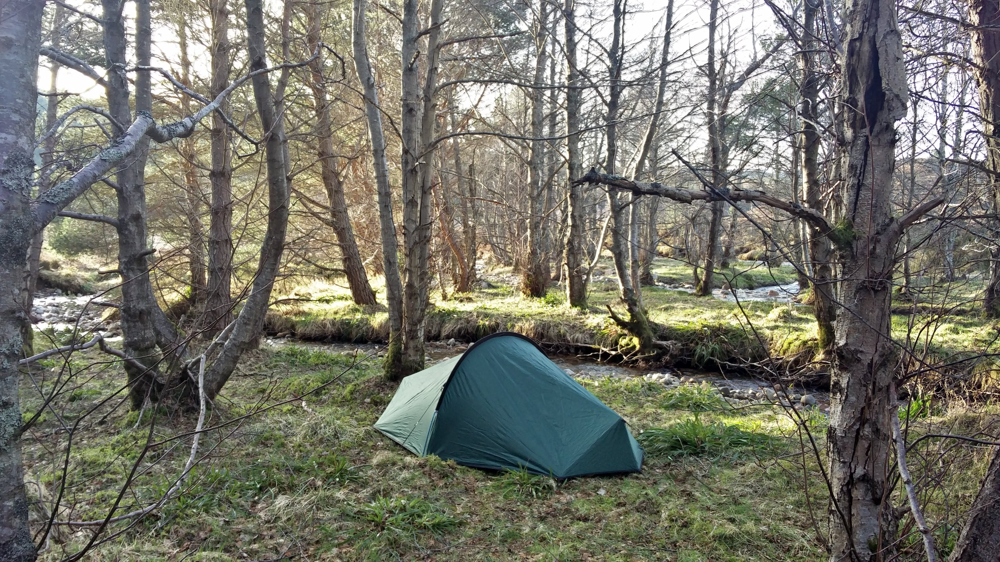

<centered-title>
    <h1>West Highland Way</h1>
    <small>May, 2017 ⋅ Scotland</small>
</centered-title>

The West Highland Way is one of the most well-known long distance trails in all of Scotland. What made this trek special to me is not just the nature, which is an excellent exhibit of what Scotland has to offer, but the incredibly social nature of the trail. With plenty of people walking the trail, you quickly strike up conversations with those you meet - this makes it one of the most memorable treks I've done to date.

The trail starts off in the beautiful rolling hills in Milngavie just north of Glasgow, and joins up to Loch Lomond within the first day of walking. The next day or two consist of walking along Loch Lomond, which happens to be the only place on the trail where tenting is prohibited outside of designated camp sites.

<picture-grid columns="2">
    
    
    
</picture-grid>

Beyond Loch Lomond the area becomes much more rugged. Although far from a difficult trail, it does start becoming more mountainous as you get further from the surrounding towns.

<picture-grid coumns="2">
    
    
</picture-grid>

Overall this was a very enjoyable solo trip. Despite not being the most impressive nature around, the trail still stands out as one of the best I've done to date, largely thanks to the people you meet along the way.

The trail itself is extremely beginner friendly, with both hostels and baggage transfer available if that's your thing.  
I can whole heartedly recommend going for it if a week of walking sounds even remotely interesting to you.

<centered-title>
    <h1>Cairngorms National Park</h1>
    <small>March, 2017 ⋅ Scotland</small>
</centered-title>

The Cairngorms National Park features a small mountain range surrounded by the towns of Aviemore and Braemar. The area is excellent for rock and ice climbing, and is home to a significant mountaineering community.  
I backpacked around the mountain range for my first solo-trek, combining it with a crash-course on basic mountaineering for future use.

The trek started off relatively simply, following the western edge of the mountain range. Walking near ground level made for some easy spring hiking.

<picture-grid columns="3">
    
    
    
</picture-grid>

After making it to the south side of the mountains, the way back was through the central mountain pass. This made for some significantly more fun walking, including a few sections of snow.

<picture-grid columns="2">
    
</picture-grid>

Unfortunately this trip was a bit underwhelming; if I were to redo it, I would definitely prioritize spending more time in the actual mountains rather than around them - possibly with some rock climbing thrown in.
